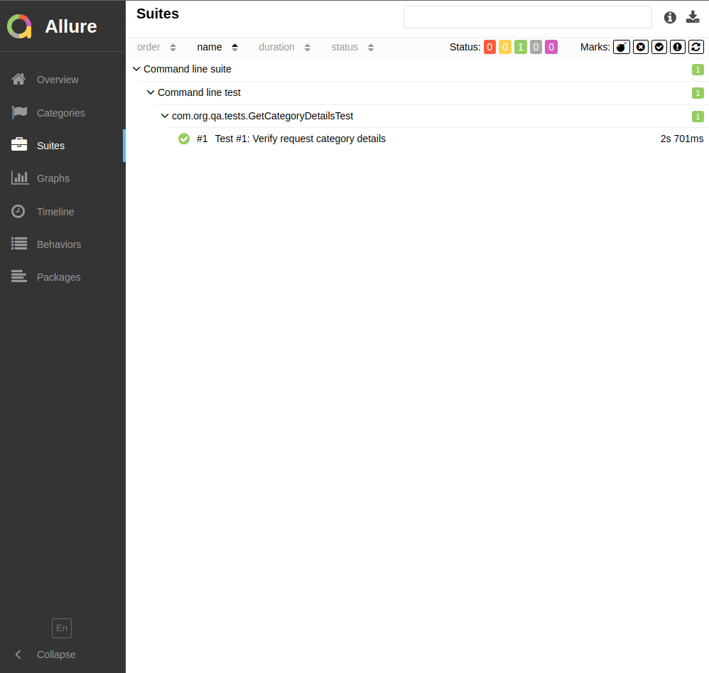

# UI Automation Exercise

## Table of contents
* [ Overview  ](# Overview  )
* [  Automated Scenarios  ](#  Automated Scenarios  )
* [ Technologies Used  ](# Technologies Used  )
* [ Test  Results  ](# Test  Results  )

## Overview
This project automated the API endpoint, https://api.tmsandbox.co.nz/v1/Categories/6327/Details.json?catalogue=false. 
This is a RestAssured based maven project.

##  Automated Scenarios
1. Validate the acceptance criteria, Name = "Carbon credits" and CanRelist = true
2. Validate the acceptance criteria, The Promotions element with Name = "Gallery" has a Description that contains the text "Good position in category"

## Technologies Used
* Java: 2.0
* TestNG: 7.4.0
* Apache Maven build tool
* RestAssured: 4.4.0
* Jackson Databind: 2.9.5

## Steps to Setting up the project
* Install and setup Java 2.0
* Install and setup Apache Maven
* Install Allure
```
npm install -g allure-commandline
```
# Steps to run the project
* Clone the project from the Git
* Open project as 'Maven project' from IDE ( IntelliJ IDEA).
* Resolve the dependencies
```
mvn clean install -DskipTests=true
```

* Run the test suite

```
mvn clean test -Dsuite=tmSandboxAPIAutomation
```

* open the project folder from terminal and type command to generate Allure
  report.
```
allure generate --clean
```

```
allure open
```
* In allure-report folder, open index.html file through the browser

## Test Results

The result can be generated as the allure report
* Results
  


